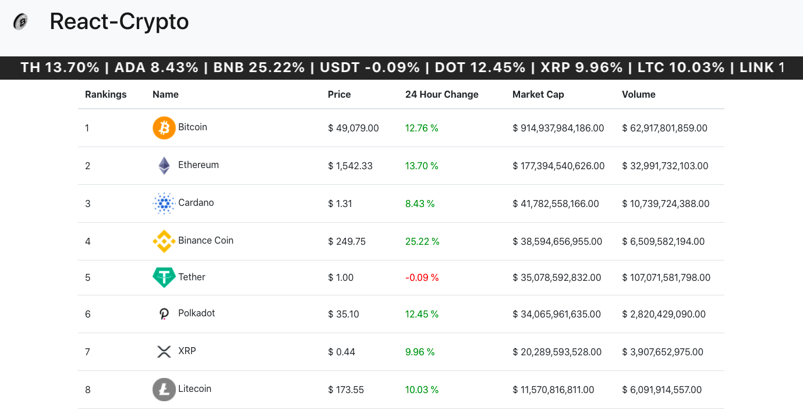
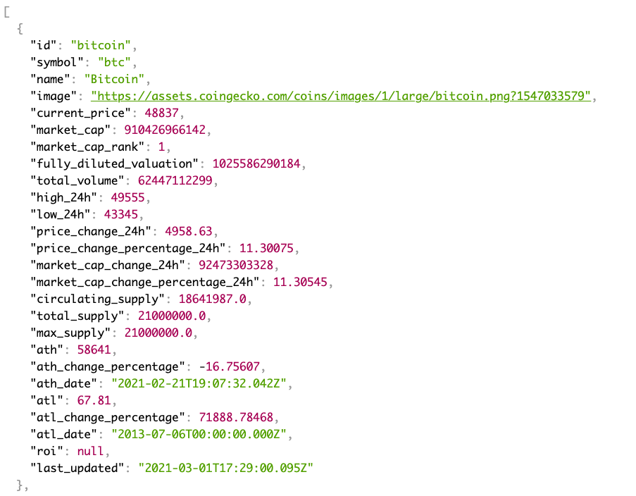
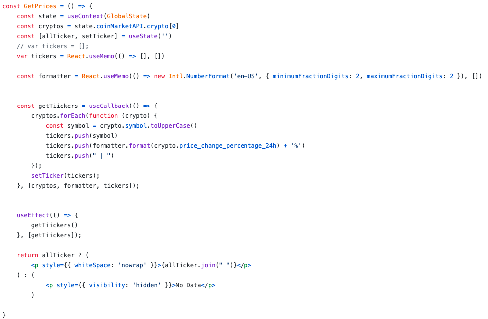
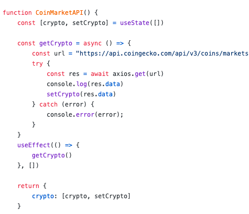

# [React Crypto](https://reactcryptolive.netlify.app/)
## [https://reactcryptolive.netlify.app/](https://reactcryptolive.netlify.app/)

## Created by: Dominique Hosea

### Feburary 2021

<!-- Link to the project via heroku -->
I have always had an interest in sneakers. In the process of making projects I wanted to make a sneaker application using a 3rd party API but I discovered there weren't any API's or there weren't any that were accessible at the time.

Sneaker API produces JSON data with descriptions, images, prices and release dates of the most popular sneakers. You can make HTTP request to my API to get the JSON data. On the home page you can see some of the sample JSON data if you click the submit button.

## Homepage 
------------

## Technologies Used
------------
This application was developed with Node.js,  React, and styling with CSS and Bootstrap.

- Express - a back-end framework

- React.js - to render clientside views

- React Ticker - a lightweight, performant React component

- Node.js - to run back end service

- BootStrap - a open-source CSS framework 

- External API - CoinGecko provides a fundamental analysis of the crypto market. 
 

Click this link here to go to [React Crypto](https://reactcryptolive.netlify.app/)

## Getting Started
------------
React Crypto is run in javaScript through React.js with axios and useEffect initiating on page load to fetch the data. That dataset is then stored in state within the GlobalState.js file that passes the data throughout the application with the useContext method. The cryptoData component receives the state and dynamically renders all of the data to the home page. The dataset is broken down and displayed in a live readable table via BootStrap with ranking, name, price 24-hour change percentage, market cap, and volume of the top 100 cryptocurrencies. 

## Data Structure
------------
### Data

### Views 

### JavaScript Functions

## Future Enhancements	
------------
- Fully integrated the backend allowing for API calls to the server 

- Add a chart of each cryptocurrencies current 7-day performance  
